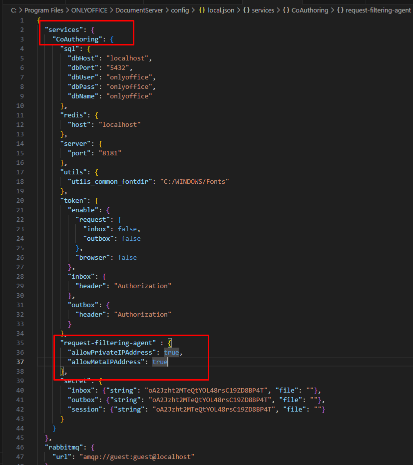

<p align="center"></p>


## Introduction 🚀

Only Office Admin panel


## Documentation 📜


## Installation ⚒️

Install qilish uchun

Talab qilinadigan modullar versiyalari

```bash
"php": "^8.1",
"postgresql": "^12.0"
"nginx",
"node.js": "^16",
"nmp" : "^10.0"
```

<h2>OnlyOffice servisi configlari</h2>

Quyidagi address dan config.json da o'zgarishlar:

```bash
%ProgramFiles%\ONLYOFFICE\DocumentServer\config\local.json
```
1. local iplarga ruxsat berish uchun

```json
services.CoAuthoring ga 
```
```bash
"request-filtering-agent" : {
      "allowPrivateIPAddress": true,
      "allowMetaIPAddress": true
    },
```

ni qoyish

2. OnlyOffice run qilingan port: 
```bash
  8181
```


<h2>Application run</h2>

Terminal ochiladi va quyidagi kodlar birma bir bajariladi.

1. Composer install

```bash
composer install
```

3. Application uchun unikal key generate

```bash
php artisan key:generate
```

3. Adminkani stylelari ishlashi uchun 

```bash
npm install
```

4. npm ni run qilish

```bash
npm run dev
```
5. migratsiyalar

```bash
php artisan migrate
```

6. User yaratish uchun

```bash
php artisan db:seed
```
```json
email: "test@example.com",
password: 123456
```
7. Applicationni run qilish

```bash
php artisan serve
```


